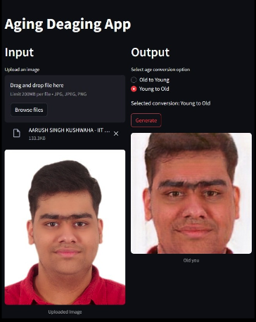
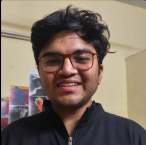
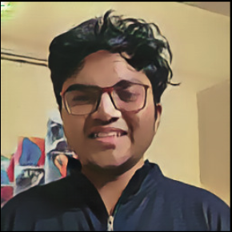
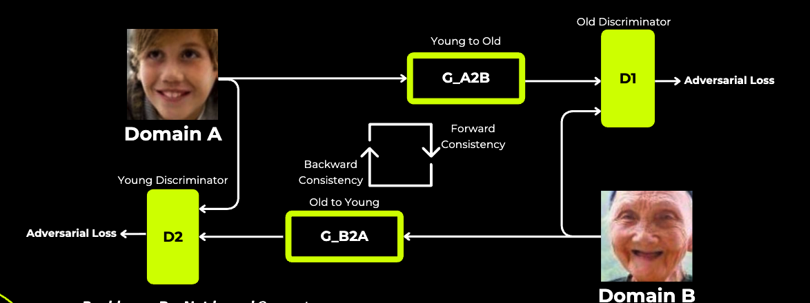

# Multi-Style Image Generation using StyleGANs

## Table of Contents

- [Multi-Style Image Generation using StyleGANs](#multi-style-image-generation-using-stylegans)
  - [Table of Contents](#table-of-contents)
  - [Overview](#overview)
  - [Key Features](#key-features)
  - [Demo Gallery](#demo-gallery)
    - [Age Manipulation](#age-manipulation)
    - [Ghibli-Style Conversion](#ghibli-style-conversion)
  - [System Architecture](#system-architecture)
  - [Datasets \& Preprocessing](#datasets--preprocessing)
  - [Implementation Details](#implementation-details)
    - [Core Techniques](#core-techniques)
    - [Sample Code Snippet: SE Block](#sample-code-snippet-se-block)
  - [Results \& Evaluation](#results--evaluation)
  - [How to Run](#how-to-run)
  - [Project Structure](#project-structure)
  - [Skills \& Tools Demonstrated](#skills--tools-demonstrated)
  - [Learnings \& Takeaways](#learnings--takeaways)
  - [References](#references)
  - [Acknowledgements](#acknowledgements)


## Overview

**Multi-Style Image Generation using StyleGANs** is an advanced machine learning project focused on unpaired image-to-image translation for facial images. It demonstrates:

- **Age Manipulation:** Realistic, identity-preserving transformation of faces between young and old domains.
- **Ghibli-Style Conversion:** High-fidelity translation of real faces into Studio Ghibli-inspired anime style, and vice versa.

The project leverages state-of-the-art GAN architectures, integrates multiple attention mechanisms, and is built with production-grade practices for data handling, code modularity, and documentation—making it ideal for showcasing ML expertise in internship applications.

## Key Features

- **Attention-Augmented GANs:** Incorporates Squeeze-and-Excitation (SE), CBAM, and Coordinate Attention modules for enhanced feature learning.
- **CycleGAN Backbone:** Enables unpaired domain translation with cycle consistency.
- **PatchGAN Discriminator:** Promotes sharp, realistic local details in generated images.
- **Robust Preprocessing:** Automated face detection, alignment, and normalization pipelines.
- **Custom Datasets:** Balanced, curated datasets for both real and synthetic (Ghibli-style) faces.
- **Comprehensive Documentation:** Clear code comments, modular design, and this professional README.


## Demo Gallery

### Age Manipulation



### Ghibli-Style Conversion

| Input (Real) | Output (Ghibli) |
| :--: | :--: |
|  |  |

> *More examples and a live demo are available on the [project web app](https://huggingface.co/spaces/AaSiKu/EE655_project).*

## System Architecture

- **Dual Generators:** G_A2B (real → Ghibli), G_B2A (Ghibli → real)
- **Dual Discriminators:** D_A (real), D_B (Ghibli)
- **Attention-Enabled Residual Blocks:** Each generator uses ResNet blocks augmented with SE/CBAM/Coordinate Attention.
- **PatchGAN Discriminators:** Evaluate 70×70 local patches for authenticity.



## Datasets \& Preprocessing

| Domain | Source | Images | Resolution | Preprocessing Steps |
| :-- | :-- | :-- | :-- | :-- |
| Real Faces | UTKFace | 4000 | 128×128 | Face detection, cropping, normalization, augmentation |
| Ghibli-Style | Stable Diffusion | 4000 | 128×128 | Synthetic generation, cropping, normalization, augmentation |

- **Augmentation:** Random flips, rotations, color jitter for robustness.
- **Balanced Batches:** Custom PyTorch DataLoaders ensure diversity and label balance[^1][^2].


## Implementation Details

### Core Techniques

- **CycleGAN Training:** Adversarial, cycle-consistency, and identity losses.
- **Attention Modules:**
    - *SE Block:* Channel-wise feature recalibration.
    - *CBAM:* Sequential channel and spatial attention.
    - *Coordinate Attention:* Encodes both channel relationships and spatial positions for precise style transfer.
- **Normalization:** Instance normalization for stable style transfer.
- **Optimization:** Adam optimizer, progressive checkpointing, and visual validation.


### Sample Code Snippet: SE Block

```python
class SEBlock(nn.Module):
    def __init__(self, channel, reduction=16):
        super(SEBlock, self).__init__()
        self.fc = nn.Sequential(
            nn.AdaptiveAvgPool2d(1),
            nn.Conv2d(channel, channel // reduction, 1),
            nn.ReLU(inplace=True),
            nn.Conv2d(channel // reduction, channel, 1),
            nn.Sigmoid()
        )
    def forward(self, x):
        weights = self.fc(x)
        return x * weights
```

*See EE655_Report.pdf for full architectural and training code.*

## Results \& Evaluation

| Attention Mechanism | Avg. Generator Loss | Epochs to Convergence |
| :-- | :-- | :-- |
| None | 1.75 | 130 |
| SE Block | 1.99 | 110 |
| Coordinate Attention | **1.05** | **66** |

- **Qualitative Evaluation:** Outputs assessed by side-by-side visual inspection and user feedback.
- **Identity Preservation:** Verified using DeepFace for select transformations.
- **Failure Cases:** Profile views, occlusions, and low-light images remain challenging[^1][^2].


## How to Run

1. **Clone the repository and install dependencies:**

```bash
git clone https://github.com/yourusername/multi-style-image-gan.git
cd multi-style-image-gan
pip install -r requirements.txt
```

2. **Prepare datasets:**
    - Download UTKFace and Ghibli datasets (see Appendix in EE655_Report.pdf).
    - Place images in `data/real` and `data/ghibli` folders.
3. **Train the model:**

```bash
python train.py --config configs/style_transfer.yaml
```

4. **Run inference:**

```bash
python inference.py --input images/test_face.jpg --style ghibli
```

5. **View results in the `outputs/` directory.**

## Project Structure

```
multi-style-image-gan/
│
├── data/
│   ├── real/
│   └── ghibli/
├── images/
│   └── ... (for README/demo images)
├── models/
│   ├── generators.py
│   ├── discriminators.py
│   └── attention_blocks.py
├── train.py
├── inference.py
├── requirements.txt
├── README.md
└── ...
```

*Follows best practices for modularity and reproducibility.*

## Skills \& Tools Demonstrated

- **Deep Learning Frameworks:** PyTorch, Torchvision
- **Generative Models:** GANs (CycleGAN, StyleGAN), attention mechanisms
- **Data Engineering:** Custom datasets, augmentation, preprocessing pipelines
- **MLOps Practices:** Modular code, clear documentation, reproducible experiments
- **Visualization:** Qualitative evaluation, demo galleries, architecture diagrams
- **Collaboration:** Version control (Git), code comments, clear README


## Learnings \& Takeaways

- **Attention modules** (especially Coordinate Attention) significantly improve style fidelity and spatial detail in unpaired image translation.
- **Careful dataset curation** and preprocessing are critical for robust generative modeling.
- **Cycle-consistency and identity losses** are essential for preserving semantic content and identity.
- **Documentation and reproducibility** are as important as model accuracy for real-world ML projects, especially for internships and collaborative environments.


## References

[1] Ian J. Goodfellow et al. "Generative Adversarial Networks." 2014. arXiv: 1406.2661 [stat.ML]. [https://arxiv.org/abs/1406.2661](https://arxiv.org/abs/1406.2661)

[2] Qibin Hou, Daquan Zhou, and Jiashi Feng. "Coordinate Attention for Efficient Mobile Network Design." 2021. arXiv: 2103.02907 [cs.CV]. [https://arxiv.org/abs/2103.02907](https://arxiv.org/abs/2103.02907)

[3] Jie Hu et al. "Squeeze-and-Excitation Networks." 2019. arXiv: 1709.01507 [cs.CV]. [https://arxiv.org/abs/1709.01507](https://arxiv.org/abs/1709.01507)

[4] Tero Karras, Samuli Laine, and Timo Aila. "A Style-Based Generator Architecture for Generative Adversarial Networks." 2019. arXiv: 1812.04948 [cs.NE]. [https://arxiv.org/abs/1812.04948](https://arxiv.org/abs/1812.04948)

[5] Ashish Vaswani et al. "Attention Is All You Need." 2023. arXiv: 1706.03762 [cs.CL]. [https://arxiv.org/abs/1706.03762](https://arxiv.org/abs/1706.03762)

[6] Sanghyun Woo et al. "CBAM: Convolutional Block Attention Module." 2018. arXiv: 1807.06521 [cs.CV]. [https://arxiv.org/abs/1807.06521](https://arxiv.org/abs/1807.06521)

[7] Jun-Yan Zhu et al. "Unpaired Image-to-Image Translation using Cycle-Consistent Adversarial Networks." 2020. arXiv: 1703.10593 [cs.CV]. [https://arxiv.org/abs/1703.10593](https://arxiv.org/abs/1703.10593)


## Acknowledgements

This project was completed as part of EE655 at IIT Kanpur by Aarush Singh Kushwaha, Anirudh Singh, Fariz Ali, and Kshitij Bhardwaj.


